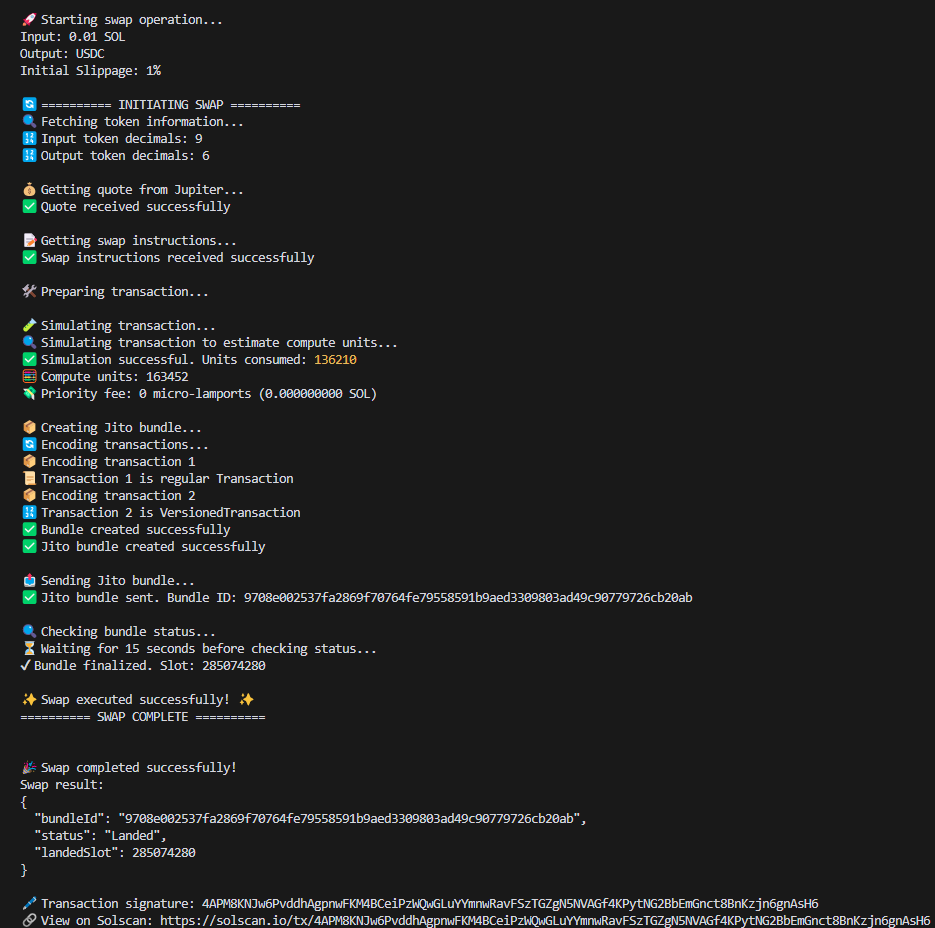

# 🚀 Solana Swap Tutorial


A comprehensive tutorial for executing token swaps on Solana using Jupiter V6, incorporating advanced features like versioned transactions, priority fees, compute budget optimization, Address Lookup Tables (ALTs), and Jito bundles.



## 📚 Table of Contents

- [Features](#-features)
- [Prerequisites](#-prerequisites)
- [Installation](#-installation)
- [Usage](#-usage)
- [TypeScript Version](#-typescript-version)
- [Code Explanation](#-code-explanation)
- [Best Practices](#-best-practices)
- [Contributing](#-contributing)
- [License](#-license)
- [💖 Support the Developer](#-support-the-developer)

## 🌟 Features

- Integration with Jupiter V6 for optimal swap routes
- Versioned transactions for improved efficiency
- Dynamic priority fees based on recent network conditions
- Compute budget optimization through transaction simulation
- Address Lookup Tables (ALTs) for reduced transaction size
- Jito bundles for MEV protection
- Comprehensive error handling and logging
- Available in both JavaScript and TypeScript

## 🛠 Prerequisites

- Node.js (v18 or later)
- npm (v6 or later)
- A Solana wallet with SOL for transaction fees
- 0.01 SOL in wallet for swap

## 📦 Installation

1. Clone the repository:

   ```bash
   git clone https://github.com/builderby/solana-swap-tutorial.git
   cd solana-swap-tutorial
   ```

2. Install dependencies:

   ```bash
   npm install
   ```

3. Create a .env file in the project root and add your Solana RPC URL, wallet private key, and Jito bundle endpoint(s). Choose the closest region. You can also tune the dynamic tip and priority fee behavior:

   ```
   SOLANA_RPC_URL=https://your-rpc-url-here
   WALLET_PRIVATE_KEY=[your,private,keypair,array,here]
   # Primary Jito bundle endpoint (default falls back to global mainnet)
   # Examples: https://ny.mainnet.block-engine.jito.wtf/api/v1/bundles
   #           https://amsterdam.mainnet.block-engine.jito.wtf/api/v1/bundles
   #           https://frankfurt.mainnet.block-engine.jito.wtf/api/v1/bundles
   #           https://tokyo.mainnet.block-engine.jito.wtf/api/v1/bundles
   #           https://slc.mainnet.block-engine.jito.wtf/api/v1/bundles
   JITO_BUNDLE_URL=https://mainnet.block-engine.jito.wtf/api/v1/bundles

   # Optional regional fallbacks (used for rotation/failover)
   # JITO_BUNDLE_URL_FALLBACK_1=https://ny.mainnet.block-engine.jito.wtf/api/v1/bundles
   # JITO_BUNDLE_URL_FALLBACK_2=https://amsterdam.mainnet.block-engine.jito.wtf/api/v1/bundles

   # Tip tuning (for bundles only the Jito tip matters)
   # Multiplier is applied to the current tip_floor (in lamports)
   JITO_TIP_MULTIPLIER=1.5
   # Absolute minimum tip if the tip_floor cannot be fetched
   JITO_MIN_TIP_LAMPORTS=1000
   # Optional: higher minimum tip only for the first attempt
   JITO_FIRST_ATTEMPT_MIN_TIP_LAMPORTS=5000
   # Priority fee selection for ComputeBudgetProgram.setComputeUnitPrice
   # Percentile: 50|75|90|95|99 (default 75)
   PRIORITY_FEE_PERCENTILE=75
   # Min/max caps in micro-lamports
   PRIORITY_FEE_MIN_MICROLAMPORTS=10000
   PRIORITY_FEE_MAX_MICROLAMPORTS=1000000
   # Optional: provider-based priority fee estimate (Helius/QuickNode)
   # Example (Helius): https://mainnet.helius-rpc.com/?api-key=YOUR_KEY
   # Example (QuickNode): https://solana-mainnet.quiknode.pro/YOUR_KEY/
   PRIORITY_FEE_PROVIDER_URL=
   PRIORITY_FEE_PROVIDER_METHOD=getPriorityFeeEstimate
   # Optional: comma-separated program/mint accounts for estimator targeting
   PRIORITY_FEE_ACCOUNT_KEYS=ComputeBudget111111111111111111111111111111
   ```

   We have included an example .env file in the repository for your convenience.

## 🚀 Usage

Run the script with:

```bash
npm start
```

This will execute a sample swap of 0.01 SOL to USDC. Modify the `main` function in `index.js` to customize the swap parameters. Ensure you have the correct token addresses and amounts for your swap in the wallet for the swap to execute.

## 📘 TypeScript Version

A fully-typed TypeScript version of this tutorial is available in the `solana-swap-tutorial-typescript` directory. It provides all the same functionality as the JavaScript version but with the added benefits of type safety and improved developer experience.

### Setting up the TypeScript Version

1. Navigate to the TypeScript directory:

   ```bash
   cd solana-swap-tutorial-typescript
   ```

2. Install dependencies:

   ```bash
   npm install
   ```

3. Create a `.env` file (or copy from the main project). Required and optional variables:
   ```
   SOLANA_RPC_URL=https://your-rpc-url-here
   WALLET_PRIVATE_KEY=[your,private,keypair,array,here]
   JITO_BUNDLE_URL=https://ny.mainnet.block-engine.jito.wtf/api/v1/bundles
   # JITO_BUNDLE_URL_FALLBACK_1=https://amsterdam.mainnet.block-engine.jito.wtf/api/v1/bundles
   # JITO_BUNDLE_URL_FALLBACK_2=https://frankfurt.mainnet.block-engine.jito.wtf/api/v1/bundles
   JITO_TIP_MULTIPLIER=1.5
   JITO_MIN_TIP_LAMPORTS=1000
   # Baseline for tip floor: ema50|p50|p75|p95|p99
   JITO_TIP_BASE=ema50
   # Escalation profile across retries (comma-separated multipliers appended to base multiplier)
   # Example: 1.0,1.2,1.5,2.0
   JITO_TIP_ESCALATION=1.0,1.2,1.5,2.0
   # Absolute cap on tip in lamports to prevent runaway bids
   JITO_MAX_TIP_LAMPORTS=2000000
   # Priority fee floor (micro-lamports) for sendTransaction fallback if you enable it later
   PRIORITY_FEE_FLOOR_MICROLAMPORTS=10000
   # Percentile-based priority fee selection with caps
   PRIORITY_FEE_PERCENTILE=75
   PRIORITY_FEE_MIN_MICROLAMPORTS=10000
   PRIORITY_FEE_MAX_MICROLAMPORTS=1000000
   ```

### Building and Running the TypeScript Version

1. Build the TypeScript code:

   ```bash
   npm run build
   ```

2. Run the compiled JavaScript:

   ```bash
   npm start
   ```

   For development with hot-reloading:

   ```bash
   npm run dev
   ```

### Fallback Handling for Address Lookup Tables

The TypeScript version includes improved error handling for Address Lookup Tables, with a fallback mechanism that allows transactions to proceed even when lookup tables cannot be retrieved or are invalid.

### Customizing the TypeScript Swap

To customize the swap parameters in the TypeScript version, modify the values in `src/index.ts`:

```typescript
const inputMint = "So11111111111111111111111111111111111111112"; // Wrapped SOL
const outputMint = "EPjFWdd5AufqSSqeM2qN1xzybapC8G4wEGGkZwyTDt1v"; // USDC
const amount = 0.01; // 0.01 SOL
const initialSlippageBps = 100; // 1% initial slippage
const maxRetries = 5;
```

## 💻 Code Explanation

The `index.js` file contains the following key components:

1. **Setup and Imports**: Essential libraries and modules are imported, and constants are defined for the Jupiter API and Jito RPC URL.

2. **Helper Functions**:

   - **`deserializeInstruction`**: Converts raw instruction data into a structured format for processing.
   - **`getAddressLookupTableAccounts`**: Fetches and deserializes Address Lookup Table accounts to optimize transaction size.

3. **Token Information Retrieval**:

   - **`getTokenInfo`**: Fetches token metadata, including decimals, to ensure accurate amount calculations.

4. **Priority Fee Calculation**:

   - **`getAveragePriorityFee`**: Dynamically calculates the average priority fee based on recent network conditions, ensuring competitive transaction fees.

5. **Jito Integration**:

   - **`getTipAccounts`**: Retrieves Jito tip accounts for MEV protection.
   - **`createJitoBundle`**: Bundles transactions for efficient execution and sends them to Jito.
   - **`sendJitoBundle`**: Sends the created Jito bundle to the network.

6. **Transaction Simulation**:

   - **`simulateTransaction`**: Simulates the transaction to estimate compute units required, adding a buffer for safety.

7. **Main Swap Function**:

   - **`swap`**: Orchestrates the entire swap process, including:
     - Fetching quotes from Jupiter V6
     - Preparing swap instructions
     - Simulating transactions for accurate compute units
     - Fetching dynamic priority fees
     - Creating versioned transactions with optimized parameters
     - Applying compute budget and priority fees
     - Bundling and sending transactions via Jito

8. **Example Usage**:
   - The `main` function demonstrates how to initiate a swap operation, specifying input and output tokens, amount, and slippage.

## Address Lookup Tables (ALTs)

Address Lookup Tables are a feature in Solana that allows transactions to reference frequently used addresses stored on-chain. This reduces transaction size and cost, especially for complex operations like token swaps. Our tutorial demonstrates how to:

- Fetch ALT accounts associated with a swap
- Incorporate ALTs into versioned transactions
- Use ALTs to optimize transaction structure and reduce fees

## Transaction Simulation

To ensure accurate compute unit allocation, we simulate the transaction before sending it. This process:

1. Constructs a transaction with all necessary instructions.
2. Simulates the transaction using `connection.simulateTransaction()`.
3. Retrieves the actual compute units consumed.
4. Adds a 20% buffer to the consumed units for safety.

This approach helps prevent transaction failures due to insufficient compute budget.

## Dynamic Priority Fees

Instead of using a fixed priority fee, we now dynamically calculate it based on recent network conditions:

1. Fetch recent prioritization fees using `connection.getRecentPrioritizationFees()`.
2. Calculate the average fee from the last 150 slots.
3. Use this average as the priority fee for the transaction.

This ensures our transactions remain competitive even as network conditions change.

## Jito Bundles

When creating a bundle that includes a tip transaction and the swap transaction, both must share the same recent blockhash. The code fetches a single latest blockhash and uses it for both the versioned swap transaction and the tip transaction to ensure they land together.

### Jito Block Engine endpoints and reliability

- The code uses an env-configured primary Jito bundles URL and optional regional fallbacks for rotation.
- Tip accounts are cached for a short period (default 60s) to avoid rate limits.
- Bundle RPC calls implement exponential backoff with jitter on 429/5xx and network timeouts.
- Update `JITO_BUNDLE_URL` to your closest region to minimize latency.

### Sending and confirming bundles (as of 2025)

- Encoding: transactions are serialized and sent as base64; `sendBundle` is called with `{ encoding: "base64" }`.
- Bundle order: `[main transaction, tip transaction]` to align with mitigation guidance and avoid leading with tip.
- Blockhash: we fetch a fresh `processed` blockhash for the main transaction; the tip transaction reuses the same blockhash.
- Endpoints:
  - `sendBundle`: use the `/bundles` path, e.g. `https://<region>.mainnet.block-engine.jito.wtf/api/v1/bundles`.
  - `getTipAccounts`, `getInflightBundleStatuses`, `getBundleStatuses`: called on the base API path, e.g. `https://<region>.mainnet.block-engine.jito.wtf/api/v1/getInflightBundleStatuses` (not `/bundles`).
- Tip strategy: we fetch `https://bundles.jito.wtf/api/v1/bundles/tip_floor` and apply `JITO_TIP_MULTIPLIER`, with a floor of `JITO_MIN_TIP_LAMPORTS`.
- Confirmation flow: we poll up to 120s with gentle backoff (2s → 5s), trying in order:
  1. `getInflightBundleStatuses` (5-minute lookback),
  2. `getBundleStatuses` (historical; includes transaction signatures),
  3. Solana RPC `getSignatureStatuses` for the main transaction signature.
     We only exit early on Landed/Failed; otherwise we continue polling.

### Dealing with rate limits (429)

- Prefer a single closest region in `JITO_BUNDLE_URL`. Use 0–2 fallbacks max.
- Let the built-in backoff handle retries; avoid external rapid polling.
- If 429 persists, increase the confirm poll interval to 3000–5000 ms and/or request higher limits.

## 🏆 Best Practices

This tutorial implements several Solana development best practices:

- **Versioned Transactions**: Utilizes the latest transaction format for improved efficiency.
- **Compute Budget Optimization**: Uses transaction simulation to set appropriate compute units.
- **Dynamic Priority Fees**: Implements adaptive priority fees based on recent network activity.
- **Address Lookup Tables**: Leverages ALTs to reduce transaction size and cost.
- **MEV Protection**: Integrates with Jito for protection against MEV (Miner Extractable Value).
- **Error Handling**: Implements comprehensive error catching and logging for easier debugging.
- **Modular Design**: Separates concerns into distinct functions for better maintainability.
- **TypeScript Support**: Offers a fully-typed version for enhanced developer experience and code reliability.

## 🤝 Contributing

Contributions are welcome! Please feel free to submit a Pull Request.

## 📄 License

This project is licensed under the MIT License - see the LICENSE file for details.

## 💖 Support the Developer

If you found this tutorial helpful and would like to support the development of more resources like this, consider tipping! Your contributions help keep the project alive and thriving.

**Solana Wallet Address:** `jaDpUj6FzoQFtA5hCcgDwqnCFqHFcZKDSz71ke9zHZA`
**ETH Wallet Address:** `0x96aca495621E93c884A8cb054bB823Bc273C29Bb`

Thank you for your support!

Happy swapping! If you have any questions or run into issues, please open an issue in the GitHub repository.
